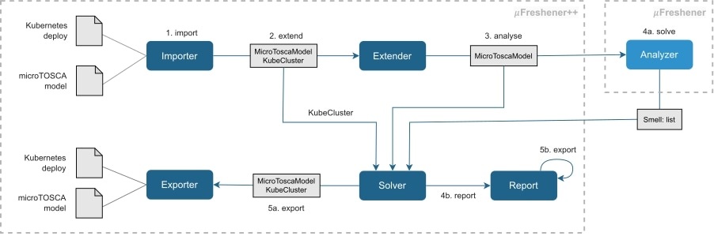
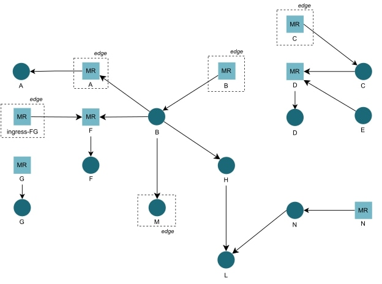
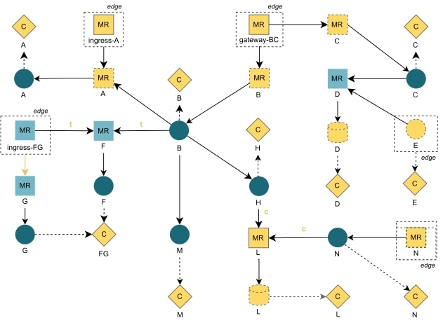
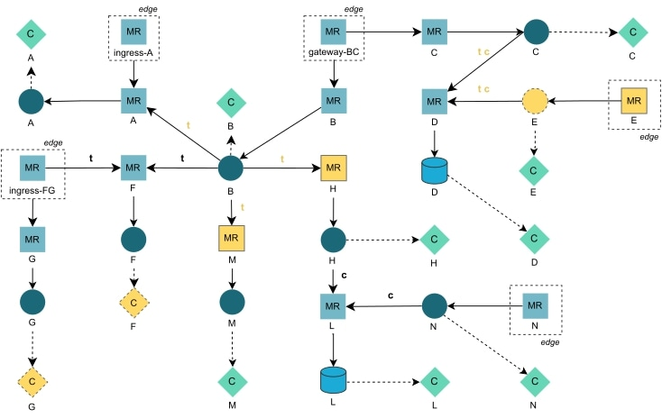

# microkure
**Microkure** is a Python tool that allows (1) to automatically applying refactoring technique for solving four architectural smells and (2) to correct and extend a microTOSCA model of a project using information retrieved from its Kubernetes deployment.

---

## What microkure can do

This tool has two main functionalities, extension and refactoring. 
It is also possible to use the Ignore functionality for ignore some actions on the specified nodes.


### Extension
The extension functionality allows to correct and enrich the microTOSCA model by using information obtained from the Kubernetes deployment files of the analyzed system.
microKure apply various controls on the Kubernetes deployment resources, and check the correspondence between the deplyment and the architecture of the microservice system described using mictoTOSCA.
For example, this functionalities check that each Kubernetes Service defined is represented in the microTOSCA model using a MessageRouter node.

After executing the extension, microkure produces a new microTOSCA model (version 1.5) which describes the system more accurately.


### Refactoring
The refactoring functionalities consist in applying refactoring techniques for solving architectural smells identified using [microFreshener-core](https://github.com/di-unipi-socc/microFreshener-core) functionalities. 
For solving each smell, this tool modify the Kubernetes deployment of the application under analysis with the addition, deletion or modification of Kubernetes resources.
This tool does not always apply completely a refactoring, but further (small) actions are required by the developer for completing its application, e.g., the developer needs to change addresses, apply port forwarding, etc.
Microkure produces, at the end of its execution, a report, which enumerates all refactoring applied, modification to the deployment made and actions necessary to complete the application of each refactoring technique.

The table below summarizes each refactoring technique applied by Microkure, with an indication of what smell it is able to solve and which further actions are required for its complete application.

| Smell                              | Refactoring Technique | **Further actions**                       |
|------------------------------------|-----------------------|-------------------------------------------|
| Multiple Services in One Pod       | Split Services        | No actions required                       |
| Wobbly Service Interaction         | Add Circuit Breaker   | Addition of error handling                |
| Wobbly Service Interaction         | Use Timeout           | Addition of error handling                |
| No API Gateway                     | Add API Gateway       | Implementation of port forwarding on host |
| Endpoint-based Service Interaction | Add Message Router    | Changing requests endpoints               |

The _Add Circuit Breaker_ refactoring generates a circuit breaker using an Istio resource and values assigned for its configuration can be altered modifying values specified in _./config/kube_config.py_ 

### Ignore
The Ignore functionality allows to ignore smell detection, extension of refactoring techniques (called _actions_) on some specified application components.
Is possible to ignore some actions on one or more specified nodes by using the _./config/ignore_config.json_ file. 
An example of ignore configuration can be observed in _./config/ignore_config_example.json_, while the entire set of values for each field is observable in the file _./config/ignore_config_values.json_

---

## Workflow
The workflow of microkure is the following:



The Importer module takes as input the _microTOSCA model_ (microFreshener-core Importer) and the _Kubernetes deployment_ (microkure Importer).
Their representation are then passed to the Extender module, which apply the extension functionality on the model. 
The produced "extended" microTOSCA model is then analyzed by the Analyzer module of microFreshener-core, that produces the list of architectural smells detected.
This list is then analyzed by the Solver module, which apply the refactoring techniques for solving smells.
The Report module is used for generating and exporting the _report_ of refactoring applied, while thorugh the Exporter are saved the new microTOSCA model and Kubernetes deployment on disk.

---

## Run microkure
microkure provides a CLI for using its functionalities. Before using it, is necessary to satisfy its requirements, by installing all its dependencies listed in the _requirements.txt_ files by using the command

```
$ pip install -r requirements.txt
```

After installing them, for running the tool the command 
```
$ python3 run.py --kube KUBE --model MODEL -r REFACTORING -ig IGNORE
```
where:
- KUBE is the path of the folder containing all the Kubernetes files of the application to analyze.
- MODEL is the path to the file which contains the MicroTosca model of the application to analyze.
- REFACTORING (optional) is used to specify one (or more) particular refactoring technique to apply. By default, all are applied.
- IGNORE (optional) is the ignore configuration, for specifying what smell, extension or refactoring needs to be ignored during the execution on a specific node. An example of ignore configuration can be observer in config/ignore_config_example.json, while all possible values are listed in config/ignore_config_values.json file

For defining timeouts and circuit breakers microkure generates Istio resources, so is necessary to have Istio running on the cluster for applying these resources correctly ([Install Istio](https://istio.io/latest/docs/setup/))

---

## Example

This is an example of execution of this tool on the MFDemo project. The execution starts from the following microTOSCA model:



After performing the extension step, this model is corrected and enriched and is modified as follows (yellow nodes are modified of created during the extension):



Then, on this model is executed the refactoring of the architectural smells found, which corrects the model and creates a new microTOSCA architecture representation:

